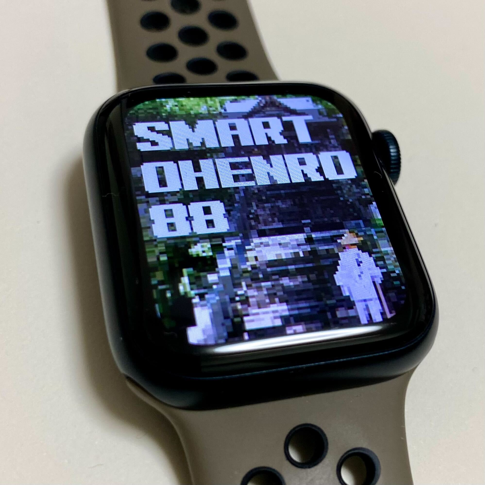

# Smart OHENRO 88

ゲームの概要

Smart OHENRO 88は、あなたのApple Watchを魔法のお遍路ガイドに変えるワクワクするゲームです。普段の生活でApple Watchを身につけるだけで、四国八十八ヶ所お遍路巡りの壮大な冒険に参加できます。移動距離がリアルタイムで記録され、あなたはまるで本物のお遍路さんのように四国の神秘的な寺院を巡る旅を楽しむことができます。さらに、このゲームでは御朱印を集める要素もあり、訪れた寺院ごとに素敵な御朱印をゲットできます。

このゲームの最大の魅力は、日常生活での移動が有意義なものへと生まれ変わり、四国八十八ヶ所の信仰につながる点です。歩くことで得られる健康面のメリットだけでなく、心の充実感や達成感も味わえるでしょう。

さあ、Apple Watchをつけて、Smart OHENRO 88で四国お遍路の冒険へ出かけましょう！

